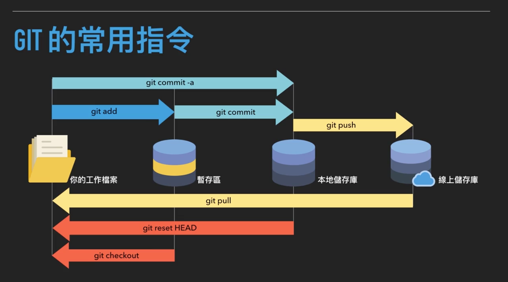
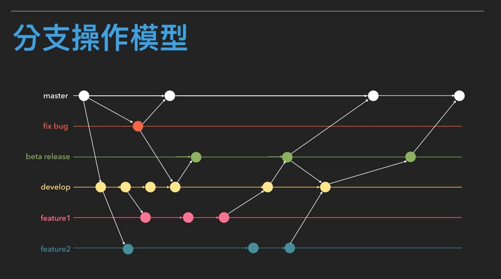

# Git

## 什麼是Git?

### GIT的功能

- 分散式多人專案合作管理系統
- 程式的版本控管
- 資料的復原機制
- 查詢程式的修改記錄

### GIT的優勢

- 非線性開發模式
- 相容於現有OS
- 有效率的處理大型專案
- 資料復原機制
- 歷史紀錄保護

### Github

是一個基於Git的程式碼管理服務商。除了允許個人和組織建立儲存庫之外，也提供了一些方便社會化軟體開發的功能，包括允許用戶追蹤其他用戶、組織、以及儲存庫的動態。亦可對程式碼的改動和bug提出評論。GitHub也提供了圖表功能，用於顯示開發者們在儲存庫上的工作進度以及軟體開發的活躍程度。

簡單說，Github就是程式開發者的社交平台。

## 使用SSH與GITHUB做連線

1. 產生SSH的金鑰：

    `$ ssh-keygen -t rsa -b 4096 -C "youEmail@example.com"`

2. 測試連線

    `$ ssh -T git@github.com`

## 精通分支的操作

### 查看分支

`$ git branch`

### 分支的建立

`$ git branch <你的分支名稱>`

#### 輸入使用者資訊

```
$ git config --global user.email <你的註冊信箱>
$ git config --global user.name <你的使用者名稱>
```

專案下使用不同的使用者資訊，就在該專案下輸入上述指令，但不含`--global` option參數。

### 切換分支

```
$ git checkout <你的分支名稱>
```

### 刪除名稱

```
$ git branch -d <你的分支名稱>
```

## git的基本指令與反悔的操作



### 將檔案加入暫存狀態

```
$ git add
```

### 提交檔案

```
$ git commit -m "提交訊息"
```

### 提交訊息的撰寫

- 以大寫開頭
- 以<動詞> + <受詞> + <內容>的文法撰寫

    `Merge pull request #2 from snoopy831002/snoopybranch`

    因為Github預設的訊息格式也是這樣的規格所撰寫的

- 提交訊息不宜過長
- 內容須具表述性與代表性

### 將檔案推上雲端儲存庫

```
$ git push "遠端主機名" "分支名稱"
```

沒什麼特別更動的話，遠端主機名(`git remote -v`)都會是origin作為線上儲存庫的位置。

### 小技巧

#### 檢視目前git的狀態

```
$ git status
```

#### 檢視git歷史紀錄

```
$ git log
```

#### 查詢遠端主機名

origin怎麼來？

```
$ git remote -v
```

以推到master branch為例

### 將檔案加入暫存狀態的反悔

```
$ git checkout
```

### 提交檔案的的反悔

提交訊息打錯 or 不想要提交這個檔案

```
$ git reset HEAD^ --soft
$ git reset HEAD^ --hard
```

- `--soft`：不更動上一次提交的檔案內容，只會移除commit的訊息
- `--hard`：使所有檔案回到上一次commit的狀態，也就是剛剛新增的內容都會被刪除的狀態

## 暫存進行中的專案進度

### 暫時儲存現狀

```
$ git stash save "訊息"
```

### 顯示暫存清單

```
$ git stash list
```

### 恢復暫存的操作

```
$ git stash pop <stask ID>
```

`<stask ID>`沒給就是暫存最近的一筆存擋；ID可用`git stash list`取得

pop指令很像是把堆疊裡面的東西取出來。

### 恢復暫存的操作

```
$ git stash apply <stask ID>
```

與`git stash pop <stask ID>`一樣功能。

apply指令就不會像pop把stash list取出後刪除，會保留。比較建議用pop。

### 刪除暫存擋

```
$ git stash drop <stask ID>
```

`<stask ID>`沒給就是刪除最近的一筆存擋

### 刪除所有暫存擋

```
$ git stash clear
```

#### 創立分支並切換到該分支上

```
$ git checkout -b <分支名稱>
```

## 分支的合併

### 將檔案從線上儲存庫拉回工作檔案

```
$ git pull
```

### 分支的合併

- master branch比你的分支還新的時候

    可以進行分支的融合
    
        - 使用merge(保留歷史紀錄)

            ```
            $ git add
            $ git commit -m "提交訊息"
            $ git checkout master
            $ git pull
            $ git checkout "你的分支名稱"
            $ git merge master
            $ git push -u "線上儲存庫位置" "分支名稱"
            ```
        
        - 使用rebase(抹去歷史紀錄)

## 專案的權限控管與 fork 的機制

### 設定遠端上游來源

```
$ git remote add upstream <上游來源>
```

可查看`git remote -v`有什麼不同

再來pull其他人專案：

```
$ git pull upstream master
```

若想修改他人專案，則需要使用`pull request`。

## Pull Request的申請與應用

簡單說，就是把你的fork專案融合進master主人中。



其他分支要合併回master，就是pull request登場的時候

## 解決分支合併時遇到的衝突

### 衝突訊息的判讀

```
<<<<<<< HEAD
本地儲存庫的程式內容
=======
遠端儲存庫的程式內容
>>>>>>> 某個分支名稱 或 commitID
```

透過線上版github的pull request來解決衝突比較友善，同時也是github近期推出的功能。

## 回復歷史資料

### 顯示提交的歷史紀錄

```
$ git log
```

### 比較commit之間的關係

```
$ git diff <commitID 1> <commitID 2>
```

### 回復之前的版本

```
$ git checkout <commit ID>
```

只回復特定檔案之前的版本：

```
$ git checkout <commit ID> <檔案名稱>
```

## .gitignore的建立與注意事項

`.gitignore`：

```
secret.txt
.DS_Store
# my first git ignore file
*.c
```

### 把所有更改過的檔案加入暫存區

```
$ git add .
```

### 刪除遠端(雲端)的檔案：

```
$ git rm <檔案名稱>
```

### 一勞永逸的忽略清單方法

```
$ vim ~/.gitignore_global
```

### 設定全域 .gitignore 檔案

```
$ git config --global core.excludesfile ~/.gitignore_global
```

## 使用github建立專屬靜態網頁

- 個人介紹網頁(1)

    1. new repository name：`<使用者帳號>.github.io`
    2. origin master下才有功用

- 專案介紹網頁(*)

    `<使用者帳號>.github.io/<專案名稱>`
    
可調整url成你購買的網域

1. 創立CNAME檔案
2. 填寫網域為內容
3. setting的Custom domain
4. 到購買網域的供應商設置github的ip位址

    1. Google Search：github page custom domain ip(找原廠官方說明文件)

        - 192.30.252.153
        - 192.30.252.154
    
    2. 增加“A”的屬性(.153, .154都要設)
